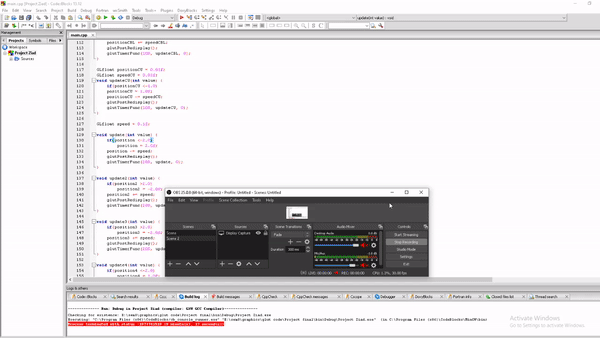

# 24-hour-cycle-of-National-Parliament-House-of-Bangladesh

Here I use C++ and OpenGL to make this project. I try to show the 24 hours of the cycle of Bangladesh parliament House. 

Features:
In the Jatiya Sangsad Bhaban, sun rises in the morning, car moves in the street, clouds moving in the sky. It suddenly starts to rain and after some times it stops raining. Then the sun moves from right to left with time and it becomes afternoon and more cars moves in the street. Then sun disappears from the sky and moon and stars shows up. The movement of car decreases in the night. Moon moves from left to right with time. In the early morning moon disappears from sky and density of car increases in the street again. Then sun rises in the morning and the day-night cycle continues.

